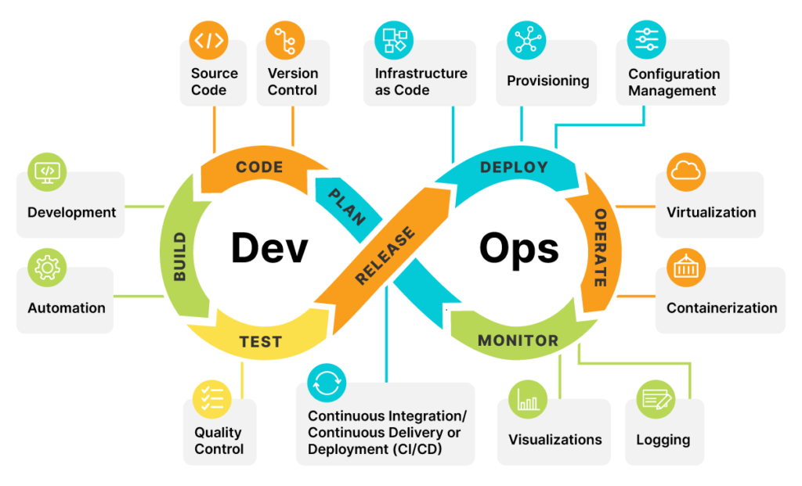
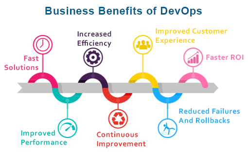

# DevOps Explained
This is an introduction to DevOps

### **What is DevOps?**  

In simple terms, DevOps is a way for software developers and IT operations (the people who make sure computer systems run smoothly) to work together more closely. It helps teams make sure new software gets created and released quickly and without problems. Instead of working separately, developers and IT ops work together to make sure everything runs smoothly from start to finish.

### **What does Dev0ps entail?**

    -Collaboration between development and operations teams

    -Faster software release cycles

    -Improved communication and coordination

    -Automation of repetitive tasks

    -Continuous integration and continuous delivery

    -Emphasis on testing and quality assurance

    -Monitoring and measurement of performance and availability

    -Focus on scalability and reliability

    -Implementation of Agile and Lean principles

    -Use of tools and technologies to support the DevOps process

    -Cultural shift towards a more collaborative and cross-functional approach

### **Benfits of DevOps**

DevOps is a rapidly growing field that has revolutionized the way organizations approach software development and IT operations. The core principles of DevOps are collaboration, automation, and continuous improvement, which allow organizations to deliver software faster, with fewer errors and at a lower cost. Here are some of the key benefits that organizations can expect to see when they implement a DevOps approach:

    Faster Time to Market: DevOps teams use automation and continuous integration/continuous delivery (CI/CD) to streamline the software development process. This means that organizations can release software updates and new features much faster than they could with traditional development methods.

    Increased Agility: DevOps teams are able to respond quickly to changing business requirements and customer needs. This allows organizations to be more agile and adapt to market changes more easily.

    Improved Collaboration: DevOps teams work closely with each other, breaking down traditional silos between development, testing, and operations. This leads to better communication, more efficient problem-solving, and faster decision-making.

    Higher Quality Software: DevOps teams use automated testing and continuous monitoring to ensure that software is of high quality. This reduces the number of errors and improves the user experience.

    Better Security: DevOps teams use automation and continuous monitoring to identify and address security vulnerabilities. This improves the overall security of the organization.

    Cost Savings: DevOps teams use automation to reduce the time and resources required to develop and deploy software. This leads to cost savings for the organization.

In conclusion, DevOps is a powerful approach that allows organizations to deliver software faster, with fewer errors and at a lower cost. By focusing on collaboration, automation, and continuous improvement, DevOps teams are able to improve the quality of the software, increase agility, and reduce costs. This makes them a valuable asset to any organization.

 